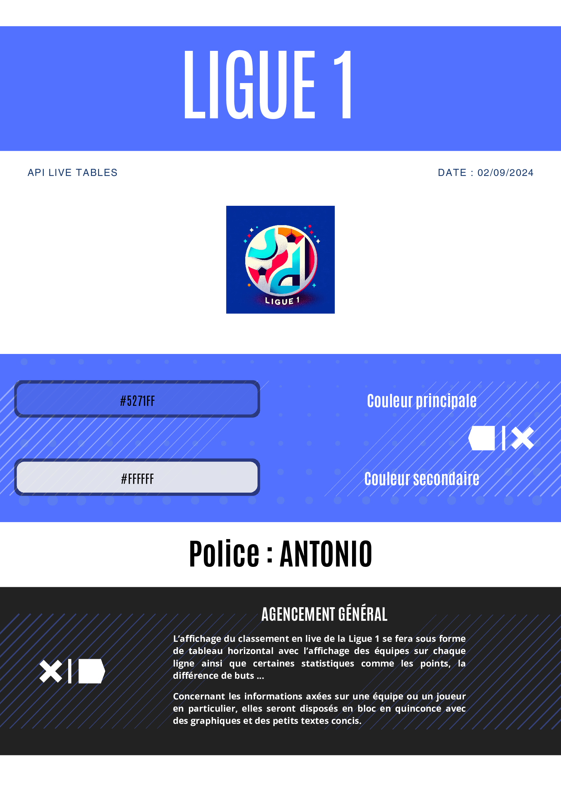

# Cahier des Charges - SL1

### 1.1 Contexte
Le championnat français de football, Ligue 1, est l'une des compétitions les plus suivies dans le monde du sport. Ce projet vise à créer une plateforme d'information dédiée à la Ligue 1 pour offrir aux fans, journalistes, et analystes un accès rapide et complet aux données et actualités du championnat.

### 1.2 Objectifs
- Fournir des informations en temps réel sur les matchs, résultats, classements, et statistiques.
- Proposer des analyses approfondies, des articles et des commentaires d'experts.
- Permettre aux utilisateurs de suivre les performances de leurs équipes et joueurs préférés.
- Offrir une expérience utilisateur fluide et intuitive sur tous les supports (web, mobile).

### 1.3 Contraintes
- Accées limités aux differentes API football, ceci est nottament dû au fait que la plupart des API sont payantes.
- 100 Reqûetes par jour pour 4 personnes.

## 2. Description des Fonctionnalités

### 2.1 Page d'Accueil
- **Présentation des matchs du jour** : Calendrier des matchs, scores en direct.
- **Actualités principales** : Articles, interviews, rumeurs de transferts.
- **Classement général** : Tableau mis à jour après chaque journée de championnat.
- **Statistiques clés** : Meilleurs buteurs, passeurs, joueurs les plus performants.

### 2.2 Fiche Équipe
- **Informations générales** : Historique, palmarès, actualités de l'équipe.
- **Effectif** : Liste des joueurs, informations sur chaque joueur (âge, nationalité, position, etc.).
- **Calendrier** : Liste des matchs à venir et résultats des matchs passés.
- **Statistiques de l'équipe** : Nombre de buts marqués, encaissés, possession moyenne, etc.

### 2.3 Fiche Joueur
- **Profil du joueur** : Photo, biographie, statistiques individuelles.
- **Statistiques de performance** : Buts, passes décisives, temps de jeu, cartons, etc.
- **Historique des performances** : Evolution des performances par saison.

## 3. Architecture Technique

### 3.1 Frontend
- **Technologies** : HTML;CSS;JS pour une interface utilisateur dynamique.
- **Responsive Design** : Adaptation pour mobiles, tablettes et ordinateurs.
- **API** : Utilisation d'APIs pour la récupération des données en temps réel (scores, statistiques, etc.).

### 3.2 Backend
- **Technologies** :  Python/Django
- **Gestion des utilisateurs** : Authentification, gestion des profils, préférences utilisateur.
- **Sauvegarde** : La sauvegarde des different fichier se fera sur GitLab.

